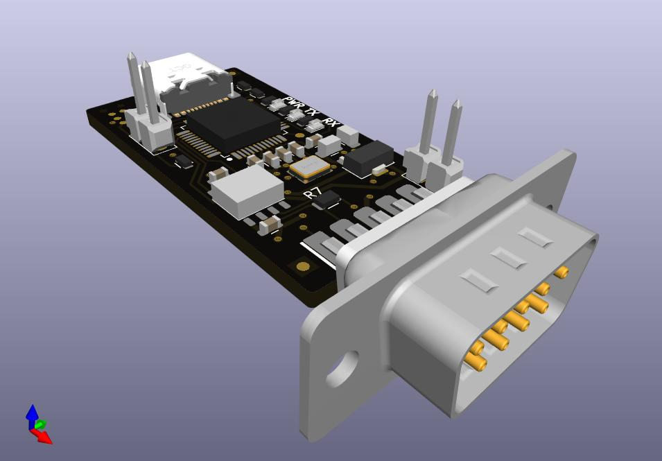
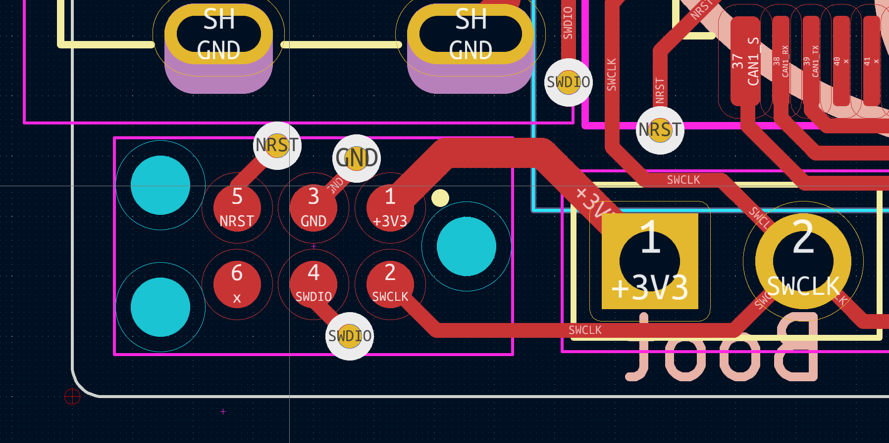

# candleLight FD

candleLight FD is a modern, CAN-FD capable version of the 
[candleLight](https://github.com/linux-automation/candleLight/) based on a STM32G0B1 microcontroller.

Out of the box it comes with a single CAN channel placed.
But footprints for a second CAN channel are available.

The candleLight FD is - like the candleLight - licensed under the CERN OHL v1.2 open hardware license.

## Where to get one

The candleLight FD is available from [Linux Automation](https://linux-automation.com)
as a SMD-assembled and functionally tested kit.

## Hardware

### Interfaces

The candleLight FD uses a USB-C (USB 2 only) connector to connect to your PC.

CAN is provided on the industry standard D-SUB9 pinout:

   * CAN1:
     * High: Pin 7
     * Low: Pin 2
   * CAN2:
     * High: Pin 8
     * Low: Pin 1
   * Power:
     * 12V: Pin 9 (can be provided via P1)
     * GND: Pin 3, Pin 6

### Releases: Revision 1

[Manufacturing Data](./release/candlelightfd-S01-R01) |
[Schematic](./release/candlelightfd-S01-R01/candlelightfd-S01-R01-V01/candlelightfd-S01-R01.pdf) |
[Interactive BOM](./release/candlelightfd-S01-R01/candlelightfd-S01-R01-V01/candlelightfd-S01-R01_BOM.html)

(This is the current release.)

Release Notes:

  * Initial release of the candleLight FD.

## Firmware

The firmware is based on the [candleLight_fw](https://github.com/candle-usb/candleLight_fw).
Select the board config `BOARD_candleLightFD` when building the firmware.

> **_NOTE_**: We are currently upstreaming our changes to the *candleLight_fw* repository.
> While doing so you can find our sources 
> [here](https://github.com/linux-automation/candleLight_fw/tree/topic/candleLightFD).

## Programming and Debugging

Everyday programming can be done via USB.
Simply invoke `dfu-util` while the device is running.
More information on flashing can be found in the
[firmware repository](https://github.com/candle-usb/candleLight_fw#flashing).

In case the device is bricked: Short the two pins labeled *BOOT* while powering on
the device.
The CPU will start in *serial download mode*.

For debugging a single wire interface is exposed on X3.
It can be connected using a [Tag Connect TC2030-IDC-NL](https://www.tag-connect.com/product/tc2030-idc-nl)
adapter.
The pinout is derived from the CandleLight.

The pinout is:

    * Pin 1: 3V3
    * Pin 2: SWCLK
    * Pin 3: GND
    * Pin 4: SWDIO
    * Pin 5: NRST
    * Pin 6: (not connected)

This picture shows X3 on the device.
X3 is the connector in the lower left corner - below the USB-C connector.

